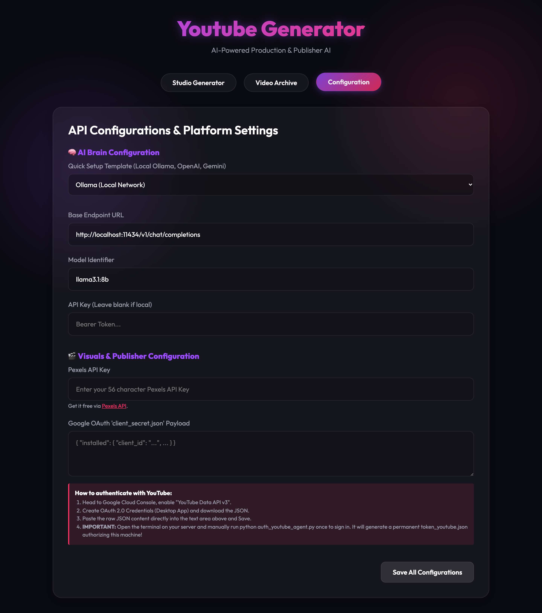
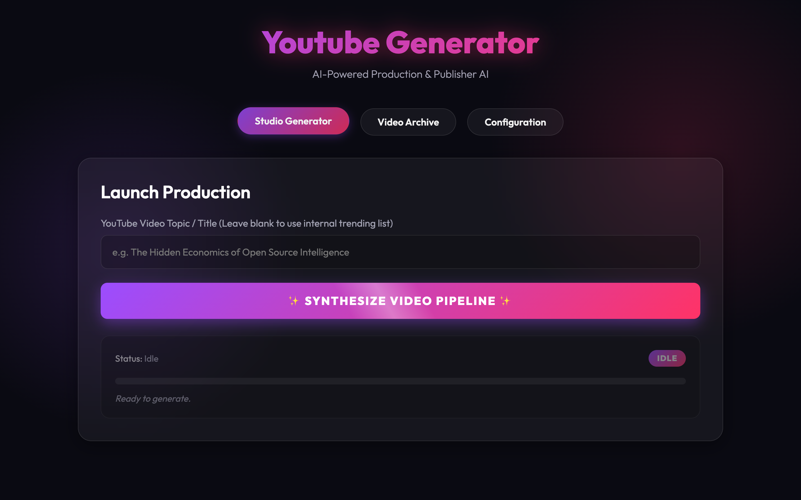
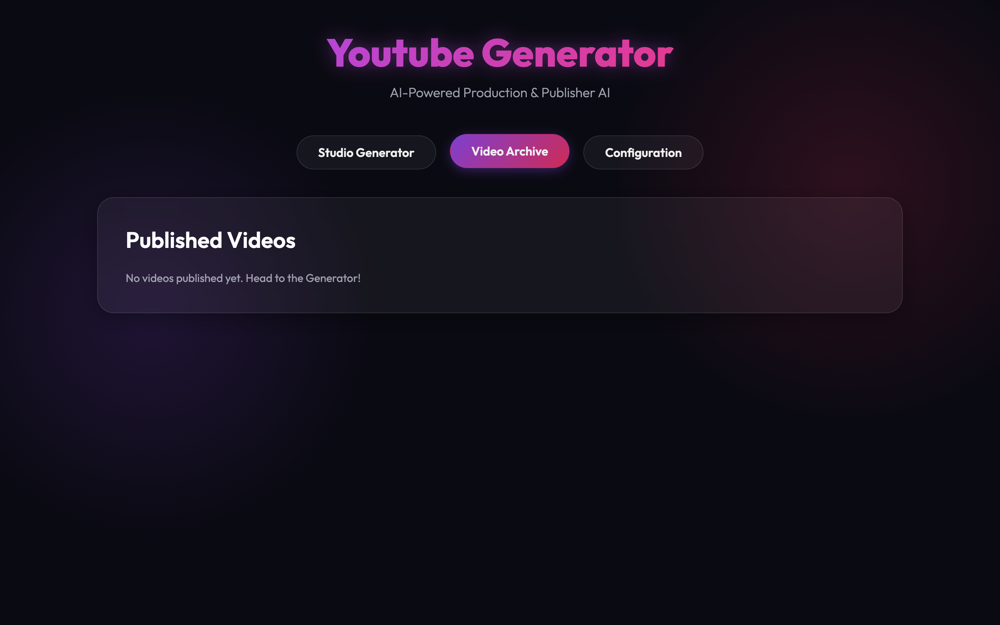

# YouTube Publisher AI: Automated AI Video Generator & Publisher 🎬🤖


<p align="center">
  <video src="intro.mp4" width="100%" controls autoplay loop muted></video>
</p>

An automated, end-to-end framework for synthesizing, generating, and publishing highly-retaining educational videos fully autonomously directly to YouTube. Engineered by **Malik Abualzait**, this faceless channel automation system perfectly handles custom topics driven by **Universal Language Models (OpenAI, Gemini, Ollama)** and **Glassmorphic UI Configurations**. 

> **🔥 Production Proven:** This exact pipeline is currently actively utilized in production by Malik Abualzait to power and auto-publish content for the [Togetherbudget](https://www.youtube.com/@togetherbudget) YouTube channel alongside several other fully automated faceless channels!

Whether you want to build an AI YouTube Automation channel, scale a faceless content strategy, or dive into Python programmatic video generation, this repository is the ultimate boilerplate!



## Core Features 🚀
The system combines state-of-the-art textual synthesis, hyper-dynamic visually engaging graphic compositions, professional voice generation, FFmpeg sub-mixing, and automatic YouTube OAuth uploading right from a slick browser-based interface!

* **Universal LLM Integration:** Dynamic script structures using the universally supported OpenAI `$v1/chat` format (compatible with GPT-4, Gemini Pro, and Local Ollama!).
* **Auto Audio Ducking:** FFmpeg sidechain compression automatically "ducks" background music under human-like Coqui/Bark generated vocals for cinematic audio quality!
* **Automated Visual Compositing:** Integrates native Pexels API image and video B-roll parsing with smart-transparency PNG infographics, stitched dynamically via Python!
* **Zero-Touch YouTube Publisher:** Built directly into the pipeline to securely upload rendered `.mp4` masterclasses with SEO-optimized titles, descriptions, and tags.

## Dashboard & Studio Generator ✨



Everything revolves around the beautiful **Glassmorphic Control Panel**. You no longer need to edit JSON files or dive into terminal commands repeatedly to manage your fully automated faceless channel!



From the dashboard you can:
1. Fire custom specific keywords right into the generator pipe.
2. View previously built content schemas natively in the built-in archive gallery folder!
3. Control specific LLM, URL APIs, and Google Credentials seamlessly via forms.

## Installation 🔧

1. **Clone the repo**
   ```bash
   git clone https://github.com/mabualzait/youtube-published.git
   cd youtube-published
   ```
2. **Install system-level dependencies**
   You require `ffmpeg` to composite the multi-channel audios and overlays!
   ```bash
   # On macOS
   brew install ffmpeg
   ```
3. **Install Python environments**
   The application fundamentally requires python 3.9+. We strongly suggest spinning off a fresh virtual environment.
   ```bash
   python3 -m venv .venv
   source .venv/bin/activate
   pip install -r requirements.txt
   ```

## Workflow Execution 🏎️

Launch the graphical dashboard! We've utilized `FastAPI` as the engine routing core.
```bash
python dashboard/app.py
```
> The dashboard will instantly boot onto `http://localhost:8080`.

## Configurations & Auth Keys 🔑

Inside the **Configurations** panel of your web dashboard, you can define exactly what API providers power the generation!

**1. Connecting AI Brains:**
Select either `Ollama`, `OpenAI`, or `Gemini` inside the Quick Connect Dropdown templates! Paste your API Key natively inside the dashboard context. No need to touch `.env` vars!

**2. Pexels Media Auth:**
Sign up at Pexels API natively to obtain a free key and throw it directly into the Visuals panel to fetch high-res looping background mp4s!

**3. Authenticating YouTube:**
- Acquire your OAuth 2.0 Client tokens directly from Google Cloud Platform Console for the YouTube API v3.
- Drag the `.json` contents into your dashboard and click `Save Configurations`.
- Run `python auth_youtube_agent.py` once manually in your local terminal. It will cleanly pop open your browser and secure a `token_youtube.json` binding it to the machine forever!

---

> **Developer & Architect:** Malik Abualzait  
> Focused on architecting the next era of autonomous AI agents and intelligent production pipelines.
